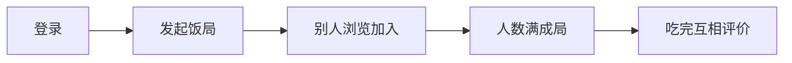

# 架构总览

> 读完这篇你就能理解：整个项目怎么跑起来的、请求从浏览器到数据库经历了什么、为什么选这些技术。

## 1. 项目在做什么

**校园饭搭子平台** — 帮大学生找人一起吃饭的工具。

MVP 阶段只跑一个闭环：


## 2. 技术栈选择

| 层 | 选型 | 为什么 |
|---|---|---|
| 运行时 | Node.js 原生 HTTP | 零外部框架依赖，方便联调，代码透明 |
| 数据库 | SQLite (better-sqlite3) | 零配置、持久化、语法和 MySQL 一样 |
| 前端 | 待上传（微信小程序/uni-app） | — |
| 开发工具 | 纯 Node.js，不需要 Docker | 快速迭代 |

> [!note] 为什么不用 Express
> 不用 Express、Koa 等框架是刻意选择。原生 HTTP 模块代码量不大（600行），但你能看到每一行在做什么——请求怎么解析、路由怎么匹配、响应怎么返回。对学习来说价值很大。后续要加中间件（日志、限流）也很容易封装。

## 3. 目录结构

```
平台代码/
├── README.md              # 项目说明
├── 开发记录.md             # 每次开发的变更日志（你的上下文锚点）
├── docs/
│   ├── API.md             # 前端对接的接口文档
│   ├── 功能代码对照.md      # "这个功能在哪个文件的哪个函数" 速查表
│   └── learn/             # 学习文档（你正在读的）
│       ├── 01-架构总览.md
│       ├── 02-数据库层详解.md
│       ├── 03-server.js详解.md
│       ├── 04-项目约定与模式.md
│       └── 05-API接口速查卡片.md
└── backend/
    ├── package.json        # 项目配置、启动脚本
    ├── data/
    │   └── fanfan.db       # SQLite 数据库文件（自动生成，可以删掉重建）
    └── src/
        ├── server.js       # 入口：路由分发 + 业务逻辑
        └── db.js           # 数据层：建表 + CRUD + 种子数据
```

核心就是两个文件：

- **[[02-数据库层详解|db.js]]** = 和数据库打交道（建表、增删改查、种子数据）
- **[[03-server.js详解|server.js]]** = 和前端打交道（接收请求、校验身份、调用 db.js、返回 JSON）

## 4. 一次请求的完整旅程

以"用户登录"为例，跟踪一次 HTTP 请求在代码里怎么走的：

```
浏览器发送 POST /api/auth/login
  body: {"nickname": "小林", "studentNo": "2026001"}
          │
          ▼
  server.js: http.createServer 回调被触发
          │
          ▼
  解析 URL 和 method，进入 if-else 路由匹配
          │
          ▼
  匹配到 POST /api/auth/login → handleLogin(req, res)
          │
          ▼
  readBody(req) 把请求体流式读出来，JSON.parse 成对象
          │
          ▼
  检查 nickname 非空 → 调 db.js 的 getUserByStudentNo()
          │
          ▼
  db.js: db.prepare("SELECT * FROM users WHERE student_no = ?").get(...)
          │
          ▼
  normalizeUser(row) 把 snake_case 转 camelCase
          │
          ▼
  如果没找到用户 → createUser() 写入数据库
          │
          ▼
  返回 { token: "dev-token-1", user, profile }
          │
          ▼
  sendJson(res, 200, data) 序列化 JSON + 设置跨域头 + 写入响应
```

## 5. 路由分发机制

没有用框架的路由器，用的是 **if-else 链式匹配**。为什么这么写？

```javascript
// 路径固定 → 精确匹配
if (method === "GET" && path === "/api/meals") { ... }

// 路径含参数 → 正则提取
const mealMatch = path.match(/^\/api\/meals\/([^/]+)$/);
if (method === "GET" && mealMatch) { ... }
```

> [!tip] 理解关键
> 固定路径用 `===`，带参数路径用 `path.match(正则)`。参数从 `match[1]` 取。
> 注意 `/api/meals/mine` 要放在 `/api/meals` 的上面——否则 `mine` 会被当成 `:mealId` 匹配走！

## 6. 数据库层是怎么封装的

[[02-数据库层详解|db.js]] 遵循一个简单模式：

```
export function xxxx(...) {
  1. 构造 SQL 字符串 + 参数数组
  2. db.prepare(sql).run(...params) 或 .get() 或 .all()
  3. 通过 normalize 函数把 snake_case 数据库字段转 camelCase
  4. 返回给调用方
}
```

每条数据库操作都是一个纯函数，server.js 不需要知道 SQLite 的存在——它只调用 `getUser(id)`、`createMeal(data)` 这样的函数。

## 7. 身份认证（MVP 简易版）

当前不是正式的用户系统，而是 **dev-token 模式**：

```
登录接口返回: { token: "dev-token-3" }

后续请求携带:  Authorization: Bearer dev-token-3
               或 X-User-Id: 3

requireUser() 解析步骤:
  1. 从 Authorization header 提取 token
  2. 去掉 "dev-token-" 前缀得到 userId
  3. 或直接从 X-User-Id header 取
  4. getUser(userId) 查数据库
```

> [!warning] 后续升级
> 正式上线前要换成 JWT 或微信登录。但接口逻辑不用改——只换 `requireUser()` 的实现即可，因为所有 handler 都通过它获取用户。

## 8. 数据流转图

```
┌─────────────────────────────────────────────────┐
│                    server.js                      │
│                                                   │
│  路由匹配 → 身份校验 → 参数验证 → 调用 db.js      │
│                                          │        │
│                                          ▼        │
│                               sendJson() 返回     │
└──────────────────────────────────┬──────────────┘
                                   │
                                   │ import
                                   ▼
┌─────────────────────────────────────────────────┐
│                     db.js                         │
│                                                   │
│  normalize() ← SQLite Row ← better-sqlite3       │
│       │                               │          │
│       ▼                               ▼          │
│  camelCase 对象              data/fanfan.db      │
└─────────────────────────────────────────────────┘
```

## 9. 和典型 Express 项目的对比

如果你熟悉 Express，这样理解我们的项目：

| Express 概念 | 我们的写法 | 在哪里 |
|---|---|---|
| `app.get('/api/meals', handler)` | `if (method==="GET" && path==="/api/meals") handler()` | server.js 路由区 |
| `app.use(express.json())` | `readBody(req)` | server.js 辅助函数 |
| `res.json(data)` | `sendJson(res, 200, data)` | server.js 辅助函数 |
| `res.status(404).json(...)` | `sendError(res, 404, code, msg)` | server.js 辅助函数 |
| 认证中间件 `authMiddleware` | `requireUser(req, res)` | server.js 辅助函数 |
| Mongoose Model | `getUser()` `createMeal()` 等函数 | db.js |
| MongoDB Schema | `CREATE TABLE IF NOT EXISTS ...` | db.js initTables() |

**我们少了什么？** Express 的中间件洋葱模型。但对我们 14 个接口的 MVP 来说，这反而让代码更直白——不需要理解 `next()`、`app.use()` 的执行顺序。

---

下一篇 → [[02-数据库层详解]]
